<div align="center">



<br/>

<a href="https://my-portfolio-nine-jet-45.vercel.app/"></a>
<a href="https://www.linkedin.com/in/swapnanil-adhikary-786375254/"></a>
<a href="https://x.com/SwapnanilA41903"></a>
<a href="https://github.com/SwapnanilAdhikary?tab=followers"></a>

</div>

<br/>

> [!NOTE]
> I build software that **does things** — clicks, speaks, decides, schedules — and I like knowing how it works all the way down: from the kernel and the allocator up to the model making the call.

## ⌁ right now

- 🎙️ **Shipping [Heed](https://github.com/SwapnanilAdhikary/Heed):** hold <kbd>⌥</kbd> <kbd>Space</kbd>, say what you want, and your Mac does it. There's no LLM in the loop.
- 🧠 **Stress-testing [Laya](https://github.com/SwapnanilAdhikary/Laya-Automations):** a 421M-parameter decision model plays Doom, Doom II and Montezuma's Revenge at the same time on one Mac.
- 🇮🇳 **Building [SAMJHA](https://github.com/SwapnanilAdhikary/SAMJHA):** voice-first informed consent for Indian retail loans, so borrowers actually understand the terms they agree to.
- 💼 **SDE at Tellia**, Paris.

## ⌁ ~/ai — things that act

<table>
<tr>
<td width="50%" valign="top">

### 🎙️ [Heed](https://github.com/SwapnanilAdhikary/Heed)
macOS menu-bar voice control. **Parakeet** (MLX, on-device) transcribes, **Laya** picks one action from a fixed list, and rules fill in the details. Opens apps, plays music, sets volume, toggles dark mode, searches the web.

  

</td>
<td width="50%" valign="top">

### 🕹️ [Laya Automations](https://github.com/SwapnanilAdhikary/Laya-Automations)
One decision model drives five games in lockstep. You ask it typed questions (*shoot?*, *which way?*, *how dangerous?*), it answers them all in one forward pass with calibrated confidence, and your own code can veto any answer.

  

</td>
</tr>
<tr>
<td width="50%" valign="top">

### 🗣️ [SAMJHA](https://github.com/SwapnanilAdhikary/SAMJHA)
*समझा — "understood."* A voice agent walks borrowers through the RBI Key Facts Statement in their own language, and records informed consent over voice instead of an emailed PDF and an OTP. Includes a KFS pipeline for PDF and Word, an eval harness pre-registered before any product code was written, and **434 passing tests**.

  

</td>
<td width="50%" valign="top">

### 🐝 [Hivemind Desktop](https://github.com/SwapnanilAdhikary/hivemind-desktop)
A single desktop app for Gmail, WhatsApp, Instagram and Discord that auto-replies with AI. It shows live agent traces as a graph and writes new tools for itself. Runs on local Ollama models with fallback to cloud models.

  

</td>
</tr>
<tr>
<td width="50%" valign="top">

### 🧪 [Agent Sandbox](https://github.com/SwapnanilAdhikary/Agent-SandBox-from-scratch)
Isolated infrastructure where AI agents can run code, browse and use tools. A Rust sandbox runtime (warm pools, a network proxy, resource limits) sits under a Python control plane that handles policy, audit logs and session replay. Sandboxes run on Docker or gVisor.

  

</td>
<td width="50%" valign="top">

### 🩺 [MedAssist](https://github.com/SwapnanilAdhikary/Med_Tell)
Agentic telemedicine for three roles: patient, doctor, and ASHA/ANM field health worker. Offers AI chat with image understanding, prescription drafts from a council of AI agents, voice calls, and a map of field-worker reports.

  

</td>
</tr>
</table>

<details>
<summary><b>more agents →</b></summary>
<br/>

| | |
|---|---|
| 📲 [**opencode ↔ WhatsApp**](https://github.com/SwapnanilAdhikary/opencode_whatsapp_Mcp) | Two-way MCP bridge to a personal WhatsApp number. Zero npm dependencies, and it never auto-answers group chats. |
| 🤝 [**MultiCollude**](https://github.com/SwapnanilAdhikary/Level-A-Research-Paper-Implementations-) | A benchmark for multi-agent collusion and correlated failure, with formal metrics and labeled traces. |
| 💘 [**Agent Date**](https://github.com/SwapnanilAdhikary/Agent_Date) | AI agents built from your WhatsApp chats go on virtual dates before you do. |
| 📈 [**Stock Screener Agent**](https://github.com/SwapnanilAdhikary/Stock-Screener-Agent-) | The agent I use to screen stocks for my own trading. |
| 🛒 [**Price Tracker**](https://github.com/SwapnanilAdhikary/Amazon_price_tracker) | A browser extension that tracks e-commerce prices. AI buying advice is on the roadmap. |

</details>

## ⌁ ~/scratch — systems, from first principles

<table>
<tr>
<td width="50%" valign="top">

### 🌈 [Pldjkfgew@345 OS](https://github.com/SwapnanilAdhikary/Pldjkfgew-345-OS)
A hobby x86 OS. A 512-byte MBR boot show (cube, song, maze) leads to a **1080p GEOS-style desktop** with a rainbow cursor, a window manager, 30+ apps, **SigilFS**, and a shell that accepts 5-7-5 haiku.

  

</td>
<td width="50%" valign="top">

### 🔎 [SOMA](https://github.com/SwapnanilAdhikary/SOMA_Engine)
Local-first semantic code search: describe what the code does, and SOMA finds it. Parses with tree-sitter, indexes incrementally, works fully offline, and also runs as an MCP tool. `pip install soma-search`

 

</td>
</tr>
<tr>
<td width="50%" valign="top">

### ⚙️ [Backyard](https://github.com/SwapnanilAdhikary/BackYard-)
A Sidekiq-inspired async job queue for Rust with SQLite or Redis backends, `#[derive(Job)]`, retries with backoff, cron scheduling and a web UI.

  

</td>
<td width="50%" valign="top">

### 🗳️ [Raft KV](https://github.com/SwapnanilAdhikary/-3-node-Raft-backed-key-value-store)
A three-node Raft cluster with leader election, log replication, linearizable GET/PUT/DELETE, and a write-ahead log for persistence.


</td>
</tr>
<tr>
<td width="50%" valign="top">

### 🧮 [Tensor Library](https://github.com/SwapnanilAdhikary/Tensor_Library-Rust-)
GPU tensors from scratch, with hand-written WGSL compute shaders running on wgpu.

 

</td>
<td width="50%" valign="top">

### 📜 [memory-safe-parser](https://github.com/SwapnanilAdhikary/Mem_Parser)
Zero-copy parsing of log-like text over memory-mapped files. Fields are `&str` views into the original bytes, with optional per-line arenas via bumpalo.


</td>
</tr>
</table>

<details>
<summary><b>more from scratch →</b></summary>
<br/>

| | |
|---|---|
| 🗺️ [**A\* vs Dijkstra on Paris**](https://github.com/SwapnanilAdhikary/Path-Finding-Algorithm-implementations-on-OpenMaps-data) | Pathfinding on real OpenStreetMap data, with animated exploration maps. |
| 💬 [**P2P chat**](https://github.com/SwapnanilAdhikary/P2P-chatRoom-CLI-in-Rust-) · [**sysmon**](https://github.com/SwapnanilAdhikary/System-Monitor-Tool-Rust-) · [**compression**](https://github.com/SwapnanilAdhikary/File_Compression_Rust-) | A growing pile of small Rust CLIs. |
| ✏️ [**Text editor in C**](https://github.com/SwapnanilAdhikary/Text_Editor_C) | A text editor written in C. |
| 🌿 [**Movy**](https://github.com/SwapnanilAdhikary/Movy) | An on-device digital-detox app with streaks, missions and a journal. Expo and SQLite, with no servers. |
| 👏 [**Dev Clapper**](https://github.com/SwapnanilAdhikary/Dev_Clapper-) | A macOS daemon: double-clap and your Mac runs an action. |

</details>

## ⌁ ~/play — maze.exe

A maze that everyone plays together, straight out of my OS's boot sequence. Steer the 🌈 cursor to the **EXIT**. Each click opens a pre-filled issue: submit it and a GitHub Action makes the move within about 30 seconds. Corridors auto-run to the next junction, so every move counts.

<!-- MAZE:START -->
<p align="center"></p>
<p align="center"><sub><b>recent</b> nobody yet. Be player one!<br/><b>top explorers</b> empty</sub></p>
<!-- MAZE:END -->

<p align="center">
  <a href="https://github.com/SwapnanilAdhikary/SwapnanilAdhikary/issues/new?title=maze%7Cup&body=Just%20press%20%2A%2ASubmit%20new%20issue%2A%2A.%20No%20need%20to%20change%20anything.%0A%0AA%20GitHub%20Action%20moves%20the%20rainbow%20cursor%2C%20redraws%20the%20maze%20on%20the%20profile%20in%20about%2030%20seconds%2C%20and%20replies%20here."></a>
  <br/>
  <a href="https://github.com/SwapnanilAdhikary/SwapnanilAdhikary/issues/new?title=maze%7Cleft&body=Just%20press%20%2A%2ASubmit%20new%20issue%2A%2A.%20No%20need%20to%20change%20anything.%0A%0AA%20GitHub%20Action%20moves%20the%20rainbow%20cursor%2C%20redraws%20the%20maze%20on%20the%20profile%20in%20about%2030%20seconds%2C%20and%20replies%20here."></a>
  <a href="https://github.com/SwapnanilAdhikary/SwapnanilAdhikary/issues/new?title=maze%7Cdown&body=Just%20press%20%2A%2ASubmit%20new%20issue%2A%2A.%20No%20need%20to%20change%20anything.%0A%0AA%20GitHub%20Action%20moves%20the%20rainbow%20cursor%2C%20redraws%20the%20maze%20on%20the%20profile%20in%20about%2030%20seconds%2C%20and%20replies%20here."></a>
  <a href="https://github.com/SwapnanilAdhikary/SwapnanilAdhikary/issues/new?title=maze%7Cright&body=Just%20press%20%2A%2ASubmit%20new%20issue%2A%2A.%20No%20need%20to%20change%20anything.%0A%0AA%20GitHub%20Action%20moves%20the%20rainbow%20cursor%2C%20redraws%20the%20maze%20on%20the%20profile%20in%20about%2030%20seconds%2C%20and%20replies%20here."></a>
</p>

## ⌁ ~/stack

<p align="center">
  
</p>

## ⌁ ~/stats

<p align="center">
  
</p>

<br/>

<div align="center">

```text
Paris, 3 a.m.
my kernel boots, then panics —
the cursor's rainbow.
```


</div>
